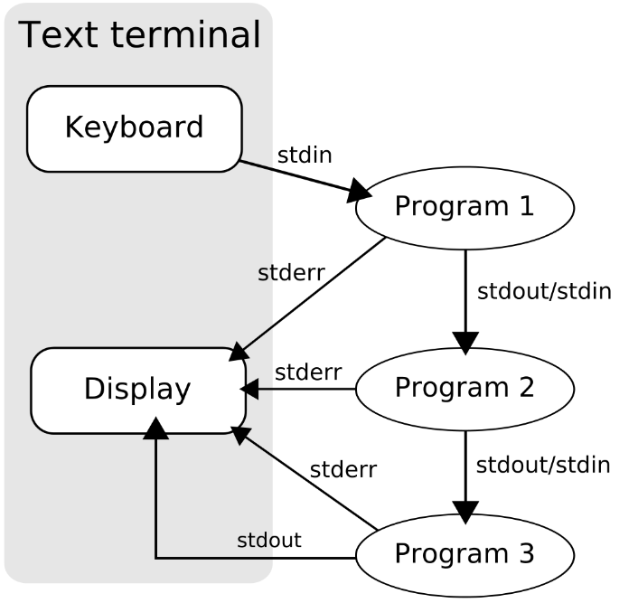
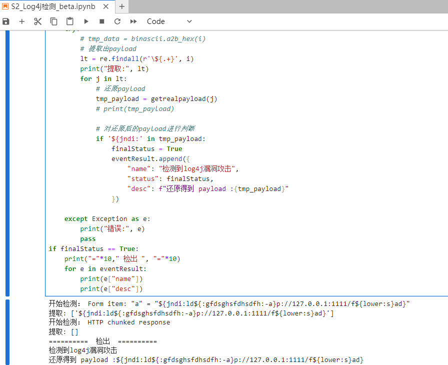
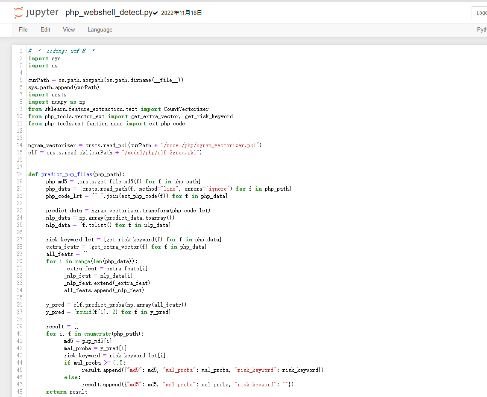

## Investigation and Analysis Function Description

<a>English</a> - 
<a href="./README_zh-cn.md">简体中文</a>

### references

[Basic use cases for investigation and analysis](../btab_example.ipynb)

[S2_Log4j detection_beta.ipynb](../S2_Log4j检测_beta.ipynb)

### Description

The investigation and analysis function is mainly to connect various data source interfaces, various processing engines, and processing processes, and use the pipeline data processing process to finally obtain the target data.

### Concept

- Pipeline data processing process

In Unix-like operating systems, a pipeline is a series of processes that link standard input and output, where the output of each process is directly used as the input of the next process. Each link is implemented by an anonymous pipe. The components in the pipeline are also called filters. This concept was invented by Douglas McIlroy for the Unix command line and is named because of its similarity to physical pipelines.



In the research process, it was also found that many products such as splunk and sentinel also used similar ideas to implement static statements. We also borrowed this concept here. However, it is generally still a single-process pipeline, so we have made a further upgrade to this concept - from a single-stream pipeline to a multi-stream pipeline. And independently designed the query language.


### Query function usage examples

1. Data extraction and processing

1.1 Query traffic package data

After uploading the traffic package on the traffic package upload page, you can obtain the traffic package data through the pcap module.

```shell
// Pull data
| pcap
|: file log4j_test.pcap
|: fields ["ip.src", "tcp.srcport", "ip.dst", "tcp.dstport", "text"]
|: condition http
```
Here, `pcap` specifies the calling engine, `file` specifies the file name, `fields` specifies the field, and `condition` specifies the query statement. The overall statement is similar to `tshark -r log4j_test.pcap -Y "http" -T fields -e ip.src -e tcp.srcport -e ip.dst -e tcp.dstport -e text`.

Here, [|] indicates the specified engine, [|:] indicates the specified variable, and all the lines starting with [|] form a pipeline.

Of course, you can use the simplest form, without setting the fields and condition parameters, and use the default parameters.

```shell
| pcap
|: file log4j_test.pcap
```
1.2 Use jq to process json

```shell
| jq
|: filter .foo.bar
|: content { "foo": { "bar": { "baz": 123 } } , "boo":"123"}
```

The above statement uses the jq engine and specifies the values ​​of its two parameters for processing.

2. Pull data and process it

```shell
// Pull data
| pcap
|: file log4j_test.pcap
|: fields ["ip.src", "tcp.srcport", "ip.dst", "tcp.dstport","text"]
|: condition http
// Process the data results of the previous step
| jq
|: filter .[0] | .text[-1:]
|: content {{R}}
```

As above, it is divided into two steps. The first step is to obtain the traffic packet data, and the second step is to use the jq tool to process json. Here, a flow process is formed through two sections of pipelines. The [{{R}}] is an inline code, which means using the result of the previous step as a reference.
3. Calling the detection engine

3.1 Calling the detection engine directly

```shell
| sqli
|: content ' union select concat(md5(2001427499))#
```

3.2 Obtaining data, processing it, and then calling the detection engine for detection

```shell
// Pulling data
| pcap
|: file sqlinjection_9.pcap
|: fields ["http.request.uri"]
|: condition http

// Processing json to obtain uri
| jq
|: filter .[].["http.request.uri"][0]
|: content {{R}}

// Calling the sql injection detection engine for detection
| sqli
|: content {{R}}
```

4. Multi-stream pipeline example

The above shows all obtain the data of the previous step, so they are all single-stream pipeline implementations. The following shows the implementation of multi-stream pipelines.

```shell
: a ' union select concat(md5(2001427499))#
: b { "foo": { "bar": { "baz": 123 } } , "boo":"123"}
: c { "foo": { "bar": { "baz": "' union select concat(md5(2001427499))#" } } , "boo":"123"}

| jq
|: filter .foo.bar
|: content {{c}}

| jq
|: filter .foo.bar
|: content {{b}}

| jq
|: filter .baz
|: content {{R[0]}}

| sqli
|: content {{R}}
```

In inline code, we can get the result of any step or global variables, so we are not limited to a single stream. For example, [{{R[0]}}] can be used to get the result of the first step, and [{{a}}] can be used to get the content of the global variable a.

The query process above is:
1) First define three global variables.
2) The first step is to get the processing variable [c] and get [{ "baz": "' union select concat(md5(2001427499))#" }]
3) The second step is to process the variable [b] and get [{ "baz": 123 }]
4) The third step is to process the result of 2) and get [' union select concat(md5(2001427499))#]
5) The fourth step is to detect the result of the previous step and detect SQL injection.

## Threat Hunting Function Description

## Description

Hunting is an iterative process that starts with a hypothesis and continues in a loop. Therefore, a function is required to accommodate the complex logical process of analysis and investigation, and to interact in real time. Therefore, it is closer to the need to use a high-level parsing language such as Python. Here we use jupyter for data analysis.

Because there will be more complex analysis than the query process, code implementation or even machine learning implementation is required, so advanced scripts are required.

### Threat Hunting Function Usage Examples

1. Basic data call and simple logical analysis

See [S2_Log4j detection_beta.ipynb], and you can understand the basic implementation from the following process.

1.1 Initialize the module first

```python
# ---------------------------------
# Initialization
# ---------------------------------
import json

# Load gRPC module interface
from btab import BTAB, Engines, Search

# Initialize the system
btabIns = BTAB()
if btabIns.Ping().Type == "success":
print("Connection successful")

# Check all available engines
eg = Engines()
if eg.CheckAlive().Type == "success":
print("Check completed")
```

1.2 Initialize the query and extract data

```python

# Initialize the query
# ​​Set the connection device
search = Search()

# Query
content = """
// Pull data
| pcap
|: file log4j_test.pcap
|: fields ["ip.src", "tcp.srcport", "ip.dst", "tcp.dstport","text"]
|: condition http
"""
result1 = search.Submit(content)
# print(result1)
# print(result1.Result)
results = json.loads(result1.Result)
len(results)
```

1.3 Use python statement logic processing

The page is displayed as follows:



2. Graphical analysis (example only)

At the same time, during the analysis process, we will encounter scenarios that require graphical analysis, such as timing analysis. Here we take [S7_ssh slow connection_beta] as an example.


It can be seen that scientific analysis tools such as matplotlib and numpy can better perform data science analysis.

3. Machine learning analysis (example only)

Naturally, machine learning modules can also be used. Call data for training or call trained models for detection. Taking [SX_webshell file machine learning detection_beta] as an example, we load the trained model for detection.

The following is the machine learning module:



The following is the call to the detection model for detection:

```python
from machinelearning.WebshellMLChecker import WebshellMLChecker
wc = WebshellMLChecker()

# ....

ret = wc.process(body["request_body"])
print("="*50)
print("_id:",r["_id"])
print("Detection result:",ret)
```